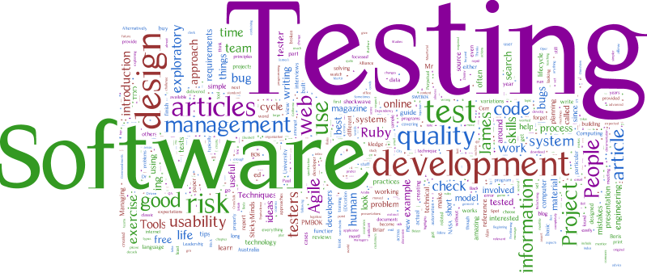

# Sobre Testes de Software

### **1. O que é Teste de Software?**
O teste de software é um processo sistemático e organizado de **verificação** e **validação** de um sistema ou aplicação para garantir que ele atenda aos requisitos especificados e funcione conforme o esperado. O objetivo principal é **identificar defeitos (bugs)** e garantir que o software seja de alta qualidade antes de ser entregue ao usuário final.

- **Verificação**: Confirma que o software foi construído corretamente, ou seja, segue as especificações e padrões técnicos.
- **Validação**: Confirma que o software atende às necessidades e expectativas do usuário final.

O teste de software não se limita apenas a encontrar bugs, mas também a avaliar atributos como desempenho, usabilidade, segurança e confiabilidade.

### **2. Por que Testar Software é Importante?**
Testar software é crucial por várias razões:

1. **Garantir Qualidade**:
   - O teste ajuda a garantir que o software funcione corretamente e atenda aos requisitos do usuário.
   - Identifica defeitos antes que o software seja liberado para produção, reduzindo o risco de falhas críticas.

2. **Reduzir Custos**:
   - Encontrar e corrigir defeitos cedo no ciclo de desenvolvimento é muito mais barato do que corrigi-los após o lançamento do software.

3. **Melhorar a Confiança**:
   - Testes bem executados aumentam a confiança dos stakeholders (desenvolvedores, gerentes, clientes) na qualidade do software.

4. **Cumprir Requisitos Legais e de Segurança**:
   - Em setores como saúde, finanças e aviação, o teste é essencial para garantir conformidade com regulamentações e evitar riscos de segurança.

5. **Facilitar a Manutenção**:
   - Software bem testado é mais fácil de manter e atualizar, pois os testes ajudam a garantir que novas alterações não introduzam novos defeitos.

---

### **3. Ciclo de Vida do Teste de Software**
O ciclo de vida do teste de software descreve as etapas pelas quais o processo de teste passa, desde o planejamento até a execução e relatório. Ele está intimamente ligado ao ciclo de vida do desenvolvimento de software (SDLC). As principais etapas são:

1. **Planejamento de Testes**:
   - Define os objetivos, escopo, recursos, cronograma e critérios de aceitação para os testes.
   - Criação do **Plano de Teste**, que documenta a estratégia de teste.

2. **Análise de Requisitos**:
   - Compreensão dos requisitos do software para identificar o que precisa ser testado.
   - Definição dos **casos de teste** com base nos requisitos funcionais e não funcionais.

3. **Desenvolvimento de Casos de Teste**:
   - Criação de cenários de teste detalhados, incluindo entradas, ações esperadas e resultados esperados.
   - Preparação dos dados de teste e ambientes de teste.

4. **Configuração do Ambiente de Teste**:
   - Montagem do ambiente onde os testes serão executados (hardware, software, redes, bancos de dados, etc.).

5. **Execução de Testes**:
   - Execução dos casos de teste manualmente ou por meio de ferramentas de automação.
   - Registro dos resultados e comparação com os resultados esperados.

6. **Relatório de Defeitos**:
   - Documentação de qualquer defeito encontrado durante a execução dos testes.
   - Priorização e encaminhamento dos defeitos para correção.

7. **Reexecução de Testes**:
   - Após a correção dos defeitos, os testes são reexecutados para garantir que os problemas foram resolvidos e que novas alterações não introduziram novos defeitos.

8. **Encerramento dos Testes**:
   - Avaliação dos resultados dos testes e elaboração de um relatório final.
   - Verificação se os critérios de aceitação foram atendidos e se o software está pronto para liberação.

---

### **4. Objetivos do Teste de Software**
Os principais objetivos do teste de software são:
- **Encontrar Defeitos**: Identificar erros no software.
- **Prevenir Defeitos**: Evitar que defeitos ocorram por meio de boas práticas de desenvolvimento e revisões.
- **Garantir Qualidade**: Assegurar que o software atenda aos requisitos e expectativas do usuário.
- **Fornecer Feedback**: Informar aos desenvolvedores e stakeholders sobre a qualidade do software.
- **Reduzir Riscos**: Minimizar a probabilidade de falhas críticas em produção.

---

### **5. Princípios do Teste de Software**
Existem alguns princípios fundamentais que guiam o processo de teste:

1. **Teste Mostra a Presença de Defeitos**:
   - O teste pode provar que há defeitos, mas não pode provar que o software está livre de defeitos.

2. **Teste Exaustivo é Impossível**:
   - Não é viável testar todas as combinações de entradas e cenários. O foco deve estar nos testes mais críticos e de maior risco.

3. **Teste Antecipado**:
   - Quanto mais cedo os testes começarem no ciclo de desenvolvimento, melhor. Isso ajuda a identificar e corrigir defeitos mais rapidamente.

4. **Agrupamento de Defeitos**:
   - Um pequeno número de módulos geralmente contém a maioria dos defeitos encontrados durante o teste.

5. **Paradoxo do Pesticida**:
   - Se os mesmos testes forem repetidos continuamente, eles deixarão de encontrar novos defeitos. É importante atualizar e revisar os casos de teste regularmente.

6. **Teste é Contexto-Dependente**:
   - A abordagem de teste varia dependendo do tipo de software, requisitos, riscos e restrições.

7. **Ausência de Erros é uma Falácia**:
   - Mesmo que o software não tenha defeitos, ele ainda pode ser inútil se não atender às necessidades do usuário.

### **6. Benefícios do Teste de Software**
- Melhoria da qualidade do software.
- Redução de custos com correções tardias.
- Aumento da satisfação do cliente.
- Maior confiabilidade e segurança do software.
- Facilitação da entrega contínua em metodologias ágeis.
