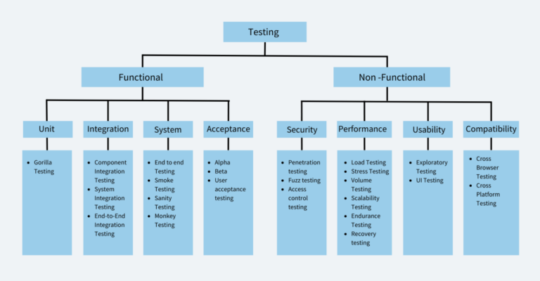

# Tipos de Teste

Os tipos de teste são categorizados com base em seus objetivos, técnicas e áreas de foco. Eles podem ser divididos em duas grandes categorias: **testes funcionais** e **testes não funcionais**. Vamos detalhar cada um deles.

### **1. Testes Funcionais**
Os testes funcionais avaliam se o software está funcionando conforme os requisitos especificados. Eles se concentram nas funcionalidades do sistema.

#### **1.1 Teste de Caixa Preta (Black-Box Testing)**
- **O que é?**
  - O teste de caixa preta foca na **entrada e saída** do sistema, sem considerar a estrutura interna do código.
  - O testador não precisa conhecer a implementação do software.

- **Objetivos**:
  - Verificar se o software atende aos requisitos funcionais.
  - Identificar erros de comportamento, interfaces e funcionalidades.

- **Técnicas**:
  - **Particionamento de Equivalência**: Divide as entradas em classes de equivalência para reduzir o número de casos de teste.
  - **Análise de Valor Limite**: Testa os valores nos limites das classes de equivalência.
  - **Tabelas de Decisão**: Usada para testar combinações de entradas e condições.
  - **Teste Baseado em Cenários**: Foca em casos de uso e fluxos de usuário.

- **Exemplo**:
  - Testar um campo de login para garantir que ele aceite entradas válidas e rejeite entradas inválidas.

- **Referência**:
  - Segundo Pressman (2010), o teste de caixa preta é essencial para validar a funcionalidade do software do ponto de vista do usuário.

---

#### **1.2 Teste de Caixa Branca (White-Box Testing)**
- **O que é?**
  - O teste de caixa branca examina a **estrutura interna** do código, como fluxos de controle, loops e condições.
  - O testador precisa conhecer a implementação do software.

- **Objetivos**:
  - Verificar a lógica interna do código.
  - Garantir que todos os caminhos do código sejam testados.

- **Técnicas**:
  - **Cobertura de Código**: Mede a porcentagem do código que foi executada durante os testes.
  - **Cobertura de Caminhos**: Testa todos os caminhos possíveis no código.
  - **Cobertura de Condições**: Verifica todas as condições lógicas no código.

- **Exemplo**:
  - Testar uma função que calcula o fatorial de um número para garantir que todos os caminhos (condições e loops) sejam executados corretamente.

- **Referência**:
  - Myers (2004) destaca que o teste de caixa branca é crucial para garantir a qualidade interna do código e a cobertura de testes.

---

#### **1.3 Teste de Regressão (Regression Testing)**
- **O que é?**
  - O teste de regressão verifica se **alterações recentes** no código não introduziram novos defeitos ou afetaram funcionalidades existentes.

- **Objetivos**:
  - Garantir que o software continue funcionando corretamente após mudanças.
  - Evitar regressões (defeitos que surgem após modificações).

- **Técnicas**:
  - Reexecução de testes existentes.
  - Uso de ferramentas de automação para testes regressivos.

- **Exemplo**:
  - Após corrigir um bug em um módulo de pagamento, reexecutar todos os testes relacionados para garantir que nada foi quebrado.

- **Referência**:
  - Beizer (1990) enfatiza a importância do teste de regressão em ambientes de desenvolvimento iterativo e incremental.

---

### **2. Testes Não Funcionais**
Os testes não funcionais avaliam atributos do software que não estão diretamente relacionados às funcionalidades, como desempenho, usabilidade e segurança.

#### **2.1 Teste de Desempenho (Performance Testing)**
- **O que é?**
  - O teste de desempenho avalia como o software se comporta sob diferentes condições de carga e estresse.

- **Objetivos**:
  - Identificar gargalos de desempenho.
  - Garantir que o software atenda aos requisitos de desempenho.

- **Tipos**:
  - **Teste de Carga (Load Testing)**: Avalia o comportamento do sistema sob carga normal ou esperada.
  - **Teste de Estresse (Stress Testing)**: Avalia o comportamento do sistema sob carga extrema.
  - **Teste de Volume (Volume Testing)**: Avalia o comportamento do sistema com grandes volumes de dados.

- **Exemplo**:
  - Testar um site de e-commerce para garantir que ele suporte 1.000 usuários simultâneos sem lentidão.

- **Referência**:
  - Jain (1991) destaca que o teste de desempenho é essencial para garantir a escalabilidade e a confiabilidade do software.

---

#### **2.2 Teste de Segurança (Security Testing)**
- **O que é?**
  - O teste de segurança verifica se o software está protegido contra vulnerabilidades e ataques.

- **Objetivos**:
  - Identificar falhas de segurança, como SQL injection, XSS, etc.
  - Garantir a confidencialidade, integridade e disponibilidade dos dados.

- **Técnicas**:
  - Varredura de vulnerabilidades.
  - Testes de penetração (penetration testing).

- **Exemplo**:
  - Testar um sistema de login para garantir que ele não seja vulnerável a ataques de força bruta.

- **Referência**:
  - OWASP (Open Web Application Security Project) fornece diretrizes amplamente utilizadas para testes de segurança.

---

#### **2.3 Teste de Usabilidade (Usability Testing)**
- **O que é?**
  - O teste de usabilidade avalia quão fácil e intuitivo é o uso do software.

- **Objetivos**:
  - Identificar problemas de interface e experiência do usuário.
  - Garantir que o software seja acessível e eficiente.

- **Técnicas**:
  - Testes com usuários reais.
  - Avaliação heurística.

- **Exemplo**:
  - Testar um aplicativo móvel para garantir que os botões sejam grandes o suficiente e que o fluxo de navegação seja intuitivo.

- **Referência**:
  - Nielsen (1993) é uma referência clássica em usabilidade, destacando a importância de testes com usuários reais.

---

### **3. Outros Tipos de Teste**

#### **3.1 Teste de Instalação (Installation Testing)**
- Verifica se o software pode ser instalado e configurado corretamente em diferentes ambientes.

#### **3.2 Teste de Compatibilidade (Compatibility Testing)**
- Avalia se o software funciona em diferentes sistemas operacionais, navegadores ou dispositivos.

#### **3.3 Teste de Recuperação (Recovery Testing)**
- Verifica se o software pode se recuperar de falhas, como quedas de energia ou perda de dados.

---

### **4. Referências Bibliográficas**
- **Pressman, R. S. (2010).** *Software Engineering: A Practitioner's Approach.*
- **Myers, G. J. (2004).** *The Art of Software Testing.*
- **Beizer, B. (1990).** *Software Testing Techniques.*
- **Jain, R. (1991).** *The Art of Computer Systems Performance Analysis.*
- **Nielsen, J. (1993).** *Usability Engineering.*

